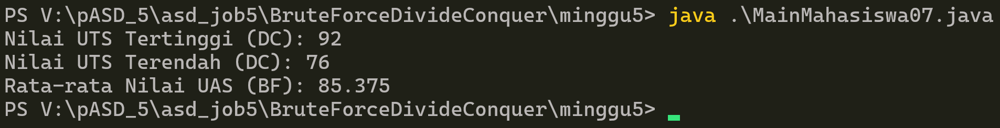
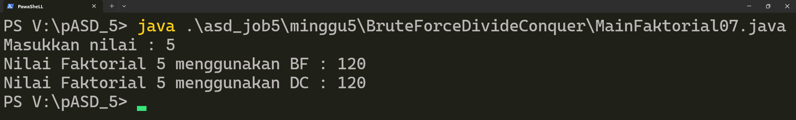
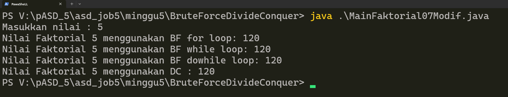
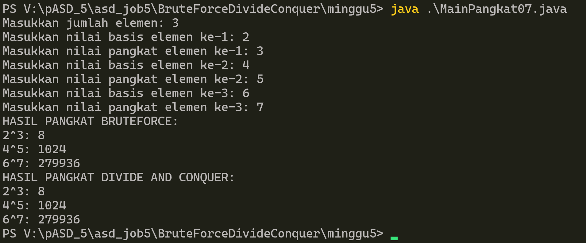
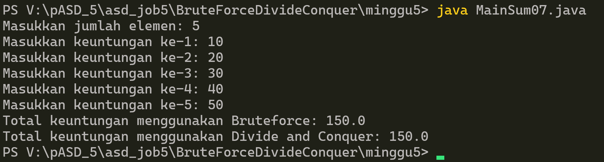

# Jobsheet 5 / Brute Force dan Divide Conquer

# [Tugas](#tugas-1)  
# [Daftar_Percobaan](#daftar_percobaan-1)  

# TUGAS  
## Latihan Praktikum    
### Soal :  
Sebuah kampus memiliki daftar nilai mahasiswa dengan data sesuai tabel berikut:

| Nama |     NIM      | Tahun Masuk | UTS | UAS |
|------|--------------|-------------|-----|-----|
| Ahmad | 220101001 | 2022 | 78 | 82 |
| Budi | 220101002 | 2022 | 85 | 88 |
| Cindy | 220101003 | 2021 | 90 | 87 |
| Dian | 220101004 | 2021 | 76 | 79 |
| Eko | 220101005 | 2023 | 92 | 95 |
| Fajar | 220101006 | 2020 | 88 | 85 |
| Gina | 220101007 | 2023 | 80 | 83 |
| Hadi | 220101008 | 2020 | 82 | 84 |

Tentukan:  
a) Nilai UTS tertinggi menggunakan Divide and Conquer!  
b) Nilai UTS terendah menggunakan Divide and Conquer!  
c) Rata-rata nilai UAS dari semua mahasiswa menggunakan Brute Force!

### Jawaban :   
[**Mahaiswa07.java**](BruteForceDivideConquer/minggu5/Mahasiswa07.java)  
[**NilaiMahaiswa07.java**](BruteForceDivideConquer/minggu5/NilaiMahasiswa07.java)  
[**MainMahaiswa07.java**](BruteForceDivideConquer/minggu5/MainMahasiswa07.java)  
Screenshot Output :   



---  

# Daftar_Percobaan
1. [Percobaan 1](#percobaan-1)
- [Pertanyaan](#pertanyaan)
    * [Jawaban](#jawaban)
2. [Percobaan 2](#percobaan-2)
- [Pertanyaan](#pertanyaan-1)
    * [Jawaban](#jawaban-1)
3. [Percobaan 3](#percobaan-3)
- [Pertanyaan](#pertanyaan-2)
    * [Jawaban](#jawaban-2)

---

## Percobaan 1
[**Faktorial07.java**](BruteForceDivideConquer/minggu5/Faktorial07.java)  
[**MainFaktorial07.java**](BruteForceDivideConquer/minggu5/MainFaktorial07.java)   
Screenshot output:  
  


[Kembali ke #Daftar_Percobaan](#daftar_percobaan-1)

### Pertanyaan
1. Pada base line Algoritma Divide Conquer untuk melakukan pencarian nilai faktorial, jelaskan perbedaan bagian kode pada penggunaan if dan else!
2. Apakah memungkinkan perulangan pada method `faktorialBF()` diubah selain menggunakan for? Buktikan!
3. Jelaskan perbedaan antara `fakto *= i;` dan `int fakto = n * faktorialDC(n-1);`!
4. Buat Kesimpulan tentang perbedaan cara kerja method `faktorialBF()` dan `faktorialDC()`!
  
[Kembali ke #Daftar_Percobaan](#daftar_percobaan-1)

### Jawaban
1. perbedaan fungsional if dan else pada algoritma Divide Conquer :
   - **if (n == 1)** adalah base case/kondisi dasar yang menghentikan rekursi. Ketika n bernilai 1, fungsi langsung mengembalikan nilai 1 tanpa melakukan panggilan rekursif lagi.  
   - **else** adalah recursive case yang memanggil fungsi itu sendiri lagi dengan parameter yang lebih kecil (n-1), yang mendekati base case. fungsi akan terus memanggil dirinya sendiri secara terus menerus tanpa henti (infinite recursion) dan menyebabkan stack overflow error **jika** fungsi rekursif tidak diberi base case/batas bawah.

2.  Ya, dapat diubah menggunakan while loop atau do-while loop. Seperti ini:    
    [**Faktorial07Modif.java**](BruteForceDivideConquer/minggu5/Faktorial07Modif.java)   
    [**MainFaktorial07Modif.java**](BruteForceDivideConquer/minggu5/MainFaktorial07Modif.java)   
      

```java
// Menggunakan while loop
int faktorialBFwhile(int n) {
    int fakto = 1;
    int i = 1;
    while (i <= n) {
        fakto *= i;
        i++;
    }
    return fakto;
}

// Menggunakan do-while loop
int faktorialBFdowhile(int n) {
    int fakto = 1;
    int i = 1;
    do {
        fakto *= i;
        i++;
    } while (i <= n);
    return fakto;
}
```

3. Perbedaan antara `fakto *= i;` dan `int fakto = n * faktorialDC(n-1);`:  
   - **`fakto *= i;`** adalah operasi assignment dalam iterasi perulangan. Variabel fakto diperbarui dengan mengkalikan nilai sebelumnya dengan i secara berulang dalam satu loop. Ini adalah pendekatan iteratif yang mengakumulasi hasil secara langsung.  
   - **`int fakto = n * faktorialDC(n-1);`** adalah pemanggilan rekursif. Fungsi memanggil dirinya sendiri dengan parameter yang lebih kecil, dan hasilnya dikalikan dengan n. Setiap pemanggilan membuat frame baru di call stack sampai mencapai base case.

4. **Kesimpulan perbedaan cara kerja method `faktorialBF()` dan `faktorialDC()`:**  
   
   | Aspek | faktorialBF() | faktorialDC() |
   |-------|---------------|---------------|
   | Pendekatan | Iteratif | Rekursif |
   | Cara Kerja | Menggunakan perulangan untuk mengkalikan nilai 1 sampai n secara berurutan | Memecah masalah menjadi beberapa masalah kecil dengan memanggil fungsi itu sendiri |
   | Kode | Lebih sederhana dan mudah dipahami untuk kasus sederhana | Sedikit lebih kompleks, tapi lebih cocok untuk masalah yang kompleks |
   | Base Case | Tidak diperlukan (loop berhenti saat kondisi tidak terpenuhi) | Diperlukan untuk menghentikan rekursi |


[Kembali ke #Daftar_Percobaan](#daftar_percobaan-1)

---

## Percobaan 2
[**Pangkat07.java**](BruteForceDivideConquer/minggu5/Pangkat07.java)  
[**MainPangkat07.java**](BruteForceDivideConquer/minggu5/MainPangkat07.java)   
Screenshot output:  
 

[Kembali ke #Daftar_Percobaan](#daftar_percobaan-1)

### Pertanyaan
1. Jelaskan mengenai perbedaan 2 method yang dibuat yaitu `pangkatBF()` dan `pangkatDC()`!
2. Apakah tahap combine sudah termasuk dalam kode tersebut? Tunjukkan!
3. Pada method `pangkatBF()` terdapat parameter untuk melewatkan nilai yang akan dipangkatkan dan pangkat berapa, padahal di sisi lain di class `Pangkat` telah ada atribut `nilai` dan `pangkat`, apakah menurut Anda method tersebut tetap relevan untuk memiliki parameter? Apakah bisa jika method tersebut dibuat dengan tanpa parameter? Jika bisa, seperti apa method `pangkatBF()` tanpa parameter?
4. Tarik kesimpulan tentang cara kerja method `pangkatBF()` dan `pangkatDC()`!

[Kembali ke #Daftar_Percobaan](#daftar_percobaan-1)

### Jawaban   
1. Perbedaan method `pangkatBF()` dan `pangkatDC()`:  
   
   | Aspek | pangkatBF() | pangkatDC() |
   |-------|-------------|-------------|
   | Pendekatan | Iteratif/Berulang (Brute Force) | Rekursif (Divide and Conquer) |
   | Cara Kerja | Mengalikan bilangan dengan dirinya sendiri secara berulang n kali | Membagi pangkat menjadi setengah, menghitung secara rekursif, lalu menggabungkan hasil |
   | Kompleksitas Waktu dan Use Case | O(n) - linier sesuai jumlah perulangan, lebih cocok untuk pangkat kecil | O(log n) - logaritmik, lebih cocok untuk pangkat besar. |

2. Ya, tahap combine sudah termasuk dalam kode method `pangkatDC()` pada bagian berikut:  
```java
if (n%2==1) { <- ganjl
        return (pangkatDC(a, n/2) * pangkatDC(a, n/2) * a); <- menggabungkan hasil
      } else { <- genap
        return (pangkatDC(a, n/2) * pangkatDC(a, n/2)); <- menggabungkan hasil
      }
```
Tahap combine terjadi saat hasil dari pemanggilan rekursif `pangkatDC(a, n/2)` dikalikan satu sama lain (dan dengan a jika pangkat ganjil) untuk menghasilkan nilai akhir.

3. Menurut pendapat saya, method dengan parameter tetap relevan karena memberikan fleksibilitas lebih. Namun, method tanpa parameter juga bisa dibuat jika sudah ada atribut nilai dan pangkat di class. contoh method `pangkatBF()` tanpa parameter bisa dibuat seperti ini:  
```java
int pangkatBF(){
  int hasil=1;
  for (int i=0; i<this.pangkat; i++) {
      hasil=hasil*this.nilai;
  }
  return hasil;
}
```
Kelebihan dengan parameter: fleksibel, bisa menghitung pangkat berapapun tanpa mengubah atribut.  
Kelebihan tanpa parameter: lebih sederhana, langsung menggunakan atribut yang sudah diatur.

4. **Kesimpulan cara kerja method `pangkatBF()` dan `pangkatDC()`:**  
   
   **pangkatBF() - Brute Force:**
   - Menggunakan pendekatan iteratif/berulang langsung yang dilakukan sebanyak n kali
   - Misal: 2³ = 2 × 2 × 2 = 8 (3 kali perkalian)
   - Sederhana dan mudah dipahami
   - Kompleksitas: O(n)
   
   **pangkatDC() - Divide and Conquer:**
   - Menggunakan pendekatan rekursif dengan membagi masalah
   - Memecah pangkat menjadi setengah: a^n = a^(n/2) × a^(n/2)
   - Misal: 2⁸ = 2⁴ × 2⁴ = (2² × 2²) × (2² × 2²) = ... (hanya 3 kali perkalian)
   - Untuk pangkat ganjil: a^n = a^(n/2) × a^(n/2) × a
   - Lebih efisien untuk pangkat besar
   - Kompleksitas: O(log n)


[Kembali ke #Daftar_Percobaan](#daftar_percobaan-1)

---

## Percobaan 3   
[**Sum07.java**](BruteForceDivideConquer/minggu5/Sum07.java)  
[**MainSum07.java**](BruteForceDivideConquer/minggu5/MainSum07.java)  
Screenshot output:  
  


[Kembali ke #Daftar_Percobaan](#daftar_percobaan-1)

### Pertanyaan
1. Kenapa dibutuhkan variable `mid` pada method `TotalDC()`?
2. Untuk apakah statement dibawah ini dilakukan dalam `TotalDC()`?
```java
double lsum = totalDC(arr, l, mid);
double rsum = totalDC(arr, mid + 1, r);
```
3. Kenapa diperlukan penjumlahan hasil lsum dan rsum seperti dibawah ini?
```java
return lsum + rsum;
```
4. Apakah base case dari `totalDC()`?
5. Tarik kesimpulan tentang cara kerja `totalDC()`!

[Kembali ke #Daftar_Percobaan](#daftar_percobaan-1)

### Jawaban
1. Variable `mid` dibutuhkan untuk membagi array menjadi dua bagian yang sama besar (atau hampir sama). Ini adalah tahap **Divide** dalam algoritma Divide and Conquer, dari titik tengah (mid), array bisa dibagi menjadi:  
   - Bagian kiri : dari indeks `l` (left) sampai `mid`
   - Bagian kanan : dari indeks `mid + 1` sampai `r` (right). 

   Tanpa variable `mid`, titik pembagian array tidak bisa ditentukan dengan tepat.

2. 
   - `int mid = (l + r) / 2;` - Menghitung indeks tengah dari array sebagai titik pembagian (tahap **Divide**)
   - `double lsum = totalDC(arr, l, mid);` - Memanggil fungsi rekursif untuk menghitung total elemen pada bagian kiri/paruh awal array (dari indeks `l` sampai mid)
   - `double rsum = totalDC(arr, mid + 1, r);` - Memanggil fungsi rekursif untuk menghitung total elemen pada bagian kanan/paruh akhir array (dari indeks mid+1 sampai `r`)
   kedua baris ini adalah tahap **Conquer** (menyelesaikan sub-masalah secara rekursif).

3. Penjumlahan `lsum + rsum` adalah tahap **Combine**, tahap terakhir dalam Divide and Conquer, hasil dari kedua bagian yang tadinya dipisah pada divide and conquer harus digabungkan lagi untuk mendapatkan total keseluruhan array. Hasil akhir array tidak akan lengkap/tercapai jika tidak melakukan langkah terakhir ini. 

4. Base case `totalDC()` :
```java
if (l == r) {
    return arr[l];
}
```
   Ketika indeks kiri (`l`) sama dengan indeks kanan (`r`), berarti array sudah tidak bisa dibagi lagi (sisa satu elemen). Pada kondisi ini, fungsi mengembalikan nilai elemen tanpa melakukan pembagian lagi, dan kondisi henti/akhir rekursi terpenuhi.

5. Kesimpulan cara kerja `totalDC()`:  
   Tahap Divide:
   - Array dibagi menjadi dua bagian di titik tengah (mid)
   - Bagian kiri/paruh awal : indeks l sampai mid
   - Bagian kanan/paruh akhir : indeks mid+1 sampai r  
   
   Tahap Conquer:
   - Setiap bagian diproses secara rekursif dengan memanggil `totalDC()` lagi
   - Pembagian terus dilakukan sampai mencapai base case (l == r)
   - Pada base case, nilai elemen tunggal dikembalikan  
   
   Tahap Combine:
   - Hasil dari bagian kiri (lsum) dan bagian kanan (rsum) dijumlahkan
   - Nilai total dikembalikan ke level rekursi sebelumnya
   
   Contoh ilustrasi:
   ```
   Array: [10, 20, 30, 40]
   
   Divide: [10, 20] | [30, 40]
   
   Divide lagi: [10] | [20] | [30] | [40]
   
   Base case: return 10, 20, 30, 40
   
   Combine: (10+20) + (30+40) = 30 + 70 = 100
   ```


[Kembali ke #Daftar_Percobaan](#daftar_percobaan-1)
